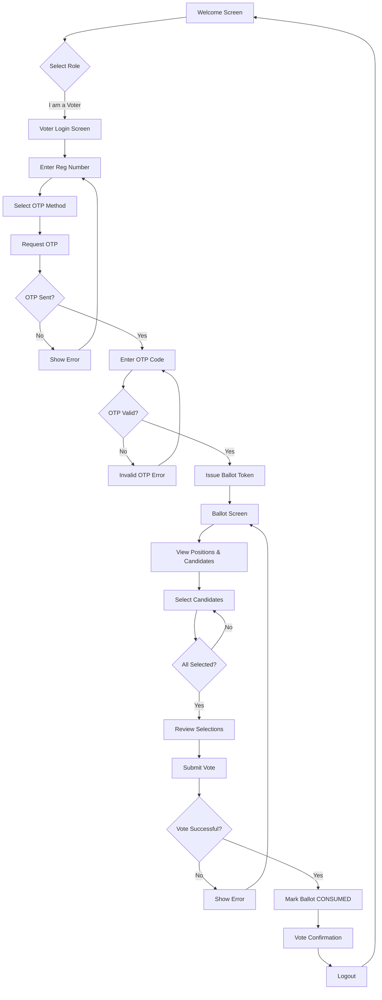
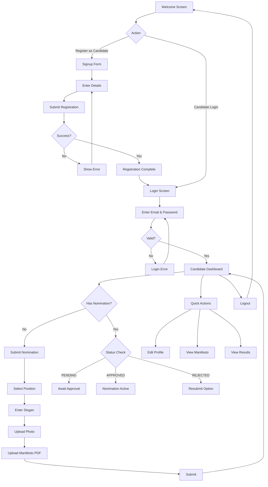
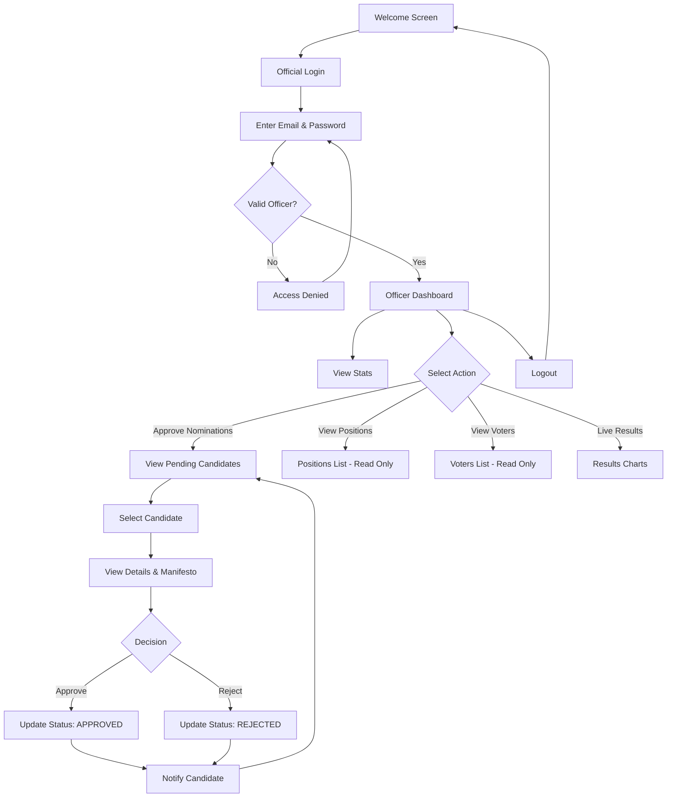
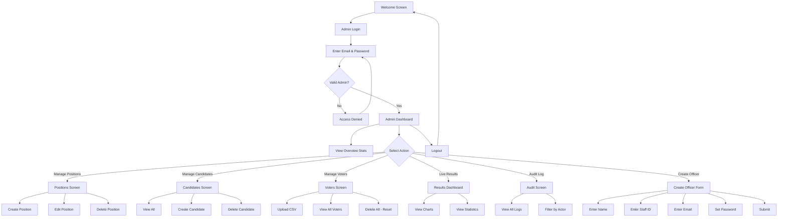
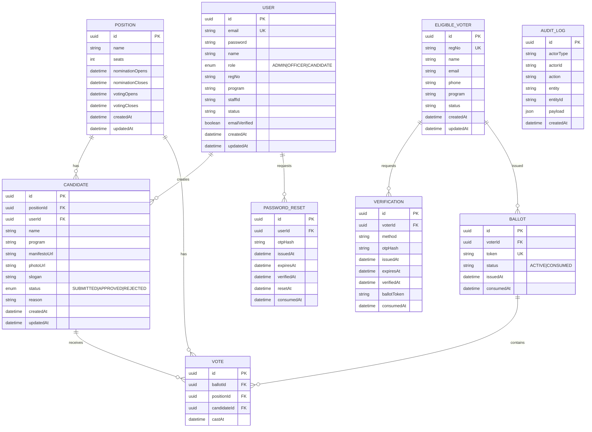

# E-Voting System - Flowcharts & ERD

## User Journey Flowcharts

### 1. Voter Journey Flowchart

---

### 2. Candidate Journey Flowchart

---

### 3. Returning Officer Journey Flowchart

---

### 4. Election Admin Journey Flowchart

---

## Entity Relationship Diagram (ERD)

---

## Database Relationships Summary

| Relationship | Type | Description |
|--------------|------|-------------|
| User → Candidate | 1:N | A user can submit multiple nominations |
| Position → Candidate | 1:N | A position has multiple candidates |
| Position → Vote | 1:N | A position receives multiple votes |
| Candidate → Vote | 1:N | A candidate receives multiple votes |
| EligibleVoter → Verification | 1:N | Voter can have multiple OTP attempts |
| EligibleVoter → Ballot | 1:N | Voter can have ballots (only 1 active) |
| Ballot → Vote | 1:N | A ballot contains votes for positions |
| User → PasswordReset | 1:N | User can request multiple resets |

---

## Key Constraints

| Table | Constraint | Purpose |
|-------|------------|---------|
| Vote | `UNIQUE(ballotId, positionId)` | One vote per position per ballot |
| Candidate | `UNIQUE(positionId, userId)` | One nomination per position per user |
| Ballot | `UNIQUE(token)` | Ballot tokens are unique |
| EligibleVoter | `UNIQUE(regNo)` | Registration numbers are unique |
| User | `UNIQUE(email)` | Email addresses are unique |
